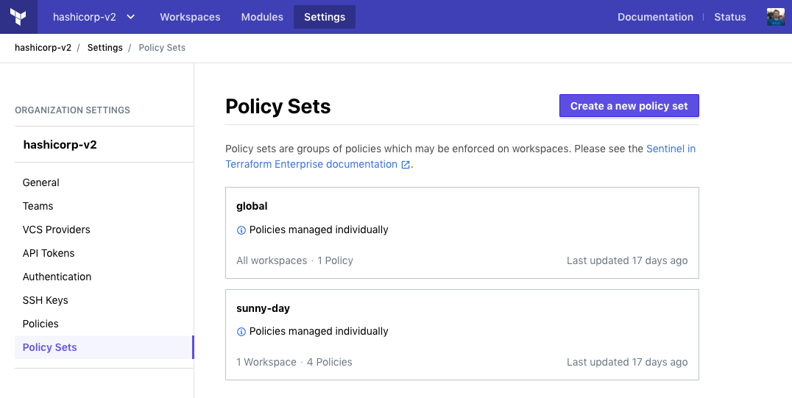

Terraform Cloud Policy Sets Migration Utility
=============================================

This repository contains a useful utility to convert individually-managed
policies and policy sets into versioned policy sets. This is achieved by using
Terraform Cloud's APIs to mirror all of an organization's policy sets into
files on the local disk, and automatically generating the necessary
`sentinel.hcl` configuration file for each policy set.

Imagine you have a couple of policy sets in Terraform Cloud like so:



To migrate these policy sets, begin by following these steps:

1. Obtain a Terraform Cloud API token with appropriate permissions to create and
   manage policy sets, and export it to your local environment like this:
   ```
   export TFE_TOKEN=dXXE5KNVu4zJzg.atlasv1.w5vImfBX...
   ```
   If you are using Terraform Enterprise (formerly Private Terraform
   Enterprise), you may specify the address of your installation like so:
   ```
   export TFE_ADDRESS=https://yourdomain.com/
   ```
2. Note the organization name in Terraform Cloud you wish to migrate policy sets
   for.
3. Invoke the migration utility, passing in the organization name, and the
   destination directory on your local disk for writing out policies and
   configurations:
   ```
   » ./tfc-policy-sets-migration hashicorp-v2 /tmp/policy-sets
   2019/07/08 10:58:40 Mirroring policy set "global" into /tmp/policy-sets/global
   2019/07/08 10:58:41 Mirroring policy set "sunny-day" into /tmp/policy-sets/sunny-day
   ```
   Note that during this step, only policy sets with individually managed
   policies will be mirrored locally. Policy sets which are already versioned
   will not be copied.
4. Check out the directory structure created by the script to ensure it matches
   your policy set configuration in Terraform Cloud:
   ```
   » tree /tmp/policy-sets/
   /tmp/policy-sets/
   ├── global
   │   ├── earth-is-round.sentinel
   │   └── sentinel.hcl
   └── sunny-day
       ├── breeze-is-cool.sentinel
       ├── humidity-is-reasonable.sentinel
       ├── sentinel.hcl
       ├── sky-is-clear.sentinel
       └── temperature-is-warm.sentinel

   2 directories, 7 files
   ```
   You should see a directory created for each policy set, a `sentinel.hcl`
   configuration file within each policy set directory, and individual
   `.sentinel` policy code files for each individual policy.

5. Now that all of the policy sets have been written to files on the local disk,
   you can configure new policy sets in Terraform Cloud to either source them
   from version control, or upload the policy sets individually as tarball
   (`tar.gz`) files. Refer to the [Sentinel documentation for Terraform
   Cloud][docs-link] for further guidance.

[docs-link]: http://terraform.io/docs/enterprise/sentinel/manage-policies.html#managing-policy-sets
